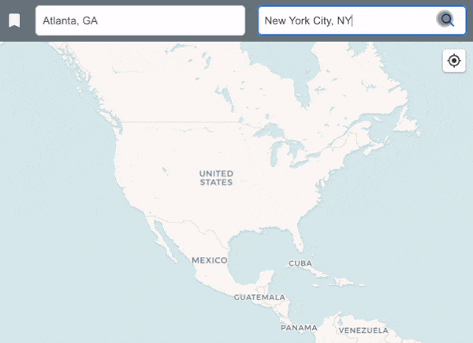

# 🌍 geocoder 

A web app that lets users discover filming locations of movies, plan routes, and manage location bookmarks.
- [React 18](https://react.dev/) with [Vite](https://vitejs.dev/)
- [Material-UI (MUI)](https://mui.com/)
- [Zustand](https://github.com/pmndrs/zustand)
- [Leaflet](https://leafletjs.com/)/[React-Leaflet](https://react-leaflet.js.org/)
- [Mapbox](https://www.mapbox.com/) for geocoding
- [TheMovieDB](https://www.themoviedb.org/documentation/api) for movie data
- [OpenWeather](https://openweathermap.org/api) for weather info
- **Backend**: [Firebase](https://firebase.google.com/)

🚀 **[Live Demo](https://movielatlong.com/)**



## Features
 - Convert addresses to/from coordinates
 - Browse filming locations with interactive maps
 - Save favorite locations
 - Real-time weather information

## Technology Stack

### Frontend
- [React 18](https://react.dev/) with [Vite](https://vitejs.dev/)

### UI Framework
- [Material-UI (MUI)](https://mui.com/)

### State Management
- [Zustand](https://github.com/pmndrs/zustand)

### Maps
- [Leaflet](https://leafletjs.com/)
- [React-Leaflet](https://react-leaflet.js.org/)

### APIs
- [Mapbox](https://www.mapbox.com/) for geocoding
- [TheMovieDB](https://www.themoviedb.org/documentation/api) for movie data
- [OpenWeather](https://openweathermap.org/api) for weather info

### Backend
- [Firebase](https://firebase.google.com/)

## Getting Started

### Prerequisites
- [Node.js](https://nodejs.org/) (v14+)
- [npm](https://www.npmjs.com/) or [yarn](https://yarnpkg.com/)
- [Firebase](https://firebase.google.com/) account
- Required API keys:
  - VITE_FIREBASE_API_KEY ([Firebase](https://firebase.google.com/))
  - VITE_MAPBOX_ACCESS_TOKEN ([Mapbox](https://docs.mapbox.com/))
  - VITE_THE_MOVIE_DB_API_KEY ([TheMovieDB](https://developer.themoviedb.org/docs/getting-started))
  - VITE_OPEN_WEATHER_API_KEY ([OpenWeather](https://openweathermap.org/api))

### Installation

1. Clone the repository:
```bash
git clone https://github.com/yourusername/geocoder.git
cd geocoder
```

2. Install dependencies:
```bash
npm install
# or
yarn
```

3. Create a `.env` file with required API keys:
```bash
VITE_FIREBASE_API_KEY=your_firebase_key
VITE_MAPBOX_ACCESS_TOKEN=your_mapbox_token
VITE_THE_MOVIE_DB_API_KEY=your_moviedb_key
VITE_OPEN_WEATHER_API_KEY=your_openweather_key
```

4. Start the development server:
```bash
npm run dev
# or
yarn dev
```

Visit `http://localhost:5173` to view the application.

### Building for Production

1. Create a production build:
```bash
npm run build
# or
yarn build
```

## License

This project is licensed under the MIT License. See the LICENSE file for more details.

## Acknowledgements

This project was created using React and Firebase platform.

## Resources

- [React.js Documentation](https://react.dev/)
- [Firebase Documentation](https://firebase.google.com/docs)
- [Material UI Documentation](https://mui.com/material-ui/getting-started/)
- [Leaflet Documentation](https://leafletjs.com/reference.html)
- [React Leaflet Documentation](https://react-leaflet.js.org/)
- [Zustand Documentation](https://docs.pmnd.rs/)
- [Mapbox Documentation](https://docs.mapbox.com/)
- [OpenWeather Documentation](https://openweathermap.org/api)
- [TheMovieDB Documentation](https://developer.themoviedb.org/docs)
